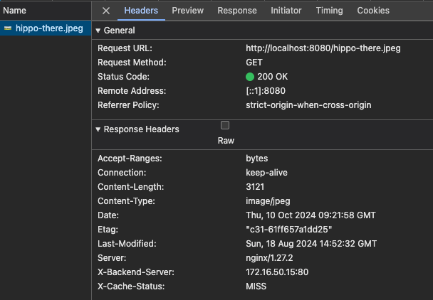
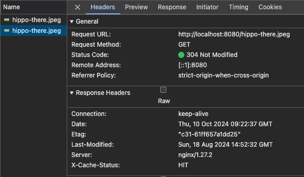
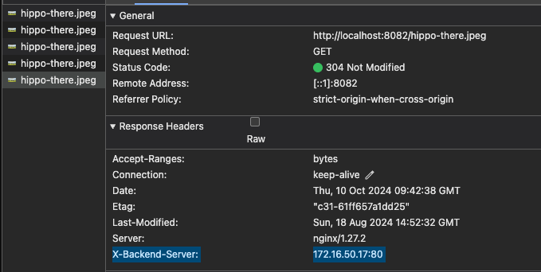
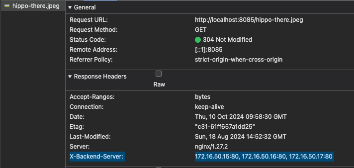
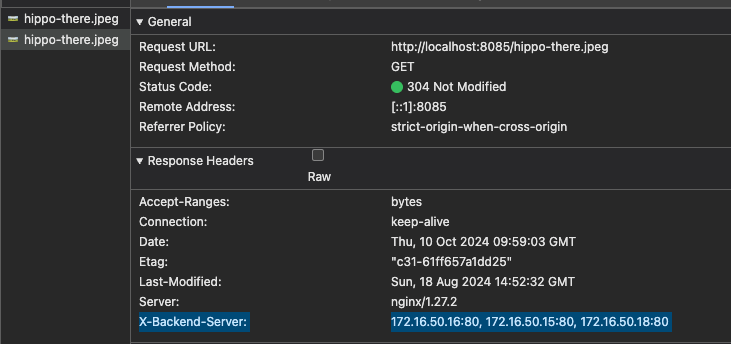

# hsa-cdn
hsa-cdn

# Task
Your goal is to create your own cdn for delivering millions of images across the globe.

Set up 7 containers: 
- bind server
- load balancer 1
- load balancer 2
- node1
- node2
- node3
- node4 

Try to implement different balancing approaches. 
Implement efficient caching. 
Write down pros and cons of each approach.

# How to start
1. Navigate to repository root and run `docker-compose up -d`

# Testing

## Round-robin

1. After all LBs are up and running, as well as service nodes navigate several times to `localhost:8080/hippo-there.jpeg` (for example)
2. Examine response headers via browser inspector 
   1. 
   2. 
3. Observed results: 
   1. first attempt was headed to node1 (`X-Backend-Server` header contains its IP, `X-Cache-Status` is `MISS`)
   2. second attempt was carried out via nginx cache and therefore `X-Cache-Status` is `HIT`

## Least connections

1. After all LBs are up and running, as well as service nodes navigate several times(>4) to `localhost:8081/hippo-there.jpeg` (for example)
2. Observed results:
   1. on each attempt `X-Backend-Server` header contained IP of next node and order of their usage changed in circles, according to how many connections were served by each node, proposing node with lower count

## IP Hash

1. After all LBs are up and running, as well as service nodes navigate several times(>4) to `localhost:8082/hippo-there.jpeg` (for example)
2. Observed result:
   1. On each attempt `X-Backend-Server` header contained one exact IP and will use it for all next requests from current client IP
   2. 

## Weighted round-robin

1. After all LBs are up and running, as well as service nodes navigate several times(>10+) to `localhost:8083/hippo-there.jpeg` (for example)
2. Observed result:
   1. In summary `X-Backend-Server` header will contain IP address of node1 (with weight=5) more often than others, and this distribution applies according to nodes weights listed on .conf file

## Consistent hashing
1. After all LBs are up and running, as well as service nodes navigate several times(>10+) to `localhost:8084/....jpeg` different resources (there are 4 images, navigate each several times)
2. Observed result:
   1. Each requested resource (image) was stuck to exact node as can be seen from `X-Backend-Server` header

## Failover
1. After all LBs are up and running, as well as service nodes navigate several times(>10+) to `localhost:8085/hippo-there.jpeg` (for example)
2. After that - turn off nodes 1 & 2
3. Again navigate several times(>10+) to `localhost:8085/hippo-there.jpeg` (for example)
4. Observed result:
   1. Before turning off nodes 1 & 2 - only node 1 & 2 were used, according to `X-Backend-Server` header info
   2. After turning off nodes 1 & 2 - after 30 seconds of retry timeout image was returned by one of nodes 3 or 4
   3. Interesting observation - `X-Backend-Server` header contained info about all nodes it LB tried before accessing target resource on backup node
      1. 
      2. 

## Balancing strategies summary
| **Balancing Strategy**   | **Pros**                                                                     | **Cons**                                        | **Free/Nginx Plus** |
|--------------------------|------------------------------------------------------------------------------|-------------------------------------------------|---------------------|
| **Round Robin**          | Simple, even distribution across servers                                     | No consideration for server load or capacity    | Free                |
| **Least Connections**    | Better for long-lived connections or varying load                            | May overload a server if connection time varies | Free                |
| **IP Hash**              | Ensures session stickiness by client IP                                      | May lead to uneven load distribution            | Free                |
| **Weighted Round Robin** | Allows more powerful servers to handle more requests                         | Complexity in configuring weights               | Free                |
| **Consistent Hashing**   | Ensures cache consistency and better request distribution for large datasets | Requires hash tuning to balance properly        | Free                |
| **Least Time**           | Optimizes for response time                                                  | Requires Nginx Plus; less predictable balancing | Nginx Plus          |
| **Failover**             | Ensures availability when primary servers fail                               | Backup servers idle during normal operation     | Free                |
| **Health Checks**        | Routes requests only to healthy servers                                      | Requires Nginx Plus; extra configuration needed | Nginx Plus          |
